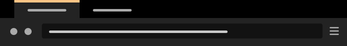
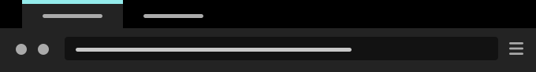
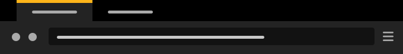
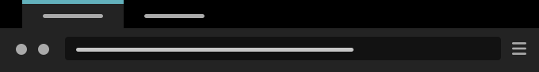
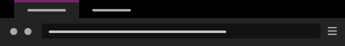

# Matte Black Themes

A few more colours for [Matte Black](https://github.com/elibroftw/matte-black-theme) to match default Linux distro themes. Please create a [new issue](https://github.com/Electw/distro-matte-black-themes/issues) for any suggestions.

## How to install

Links to each individual addons.mozilla.org page are listed below.

Alternatively, XPI files are found in each theme folder. Download the files, then drag and drop an XPI file into the Firefox browser window to install.

### Pop!_OS Orange Dark Mode

Orange accent from the System76 Pop GTK and shell dark theme.

Install [here](https://addons.mozilla.org/firefox/addon/matte-black-pop-os-orange-dark/).

### Pop!_OS Teal Dark Mode

Teal accent from the System76 Pop GTK and shell dark theme.

Install [here](https://addons.mozilla.org/firefox/addon/matte-black-pop-os-teal-dark/).

### Pop!_OS Orange Light Mode

Orange accent from the System76 Pop GTK and shell light theme.

Install [here](https://addons.mozilla.org/firefox/addon/matte-black-pop-os-orange-ligh/).

### Pop!_OS Teal Light Mode

Teal accent from the System76 Pop GTK and shell light theme.

Install [here](https://addons.mozilla.org/firefox/addon/matte-black-pop-os-teal-light/).

### Ubuntu Aubergine

Aubergine accent from Ubuntu's Yaru theme.

Install [here](https://addons.mozilla.org/firefox/addon/matte-black-ubuntu-aubergine/).